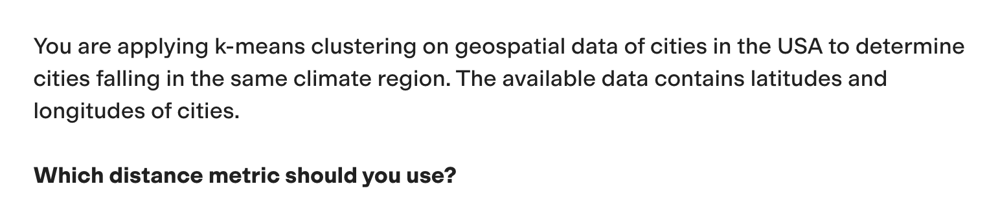
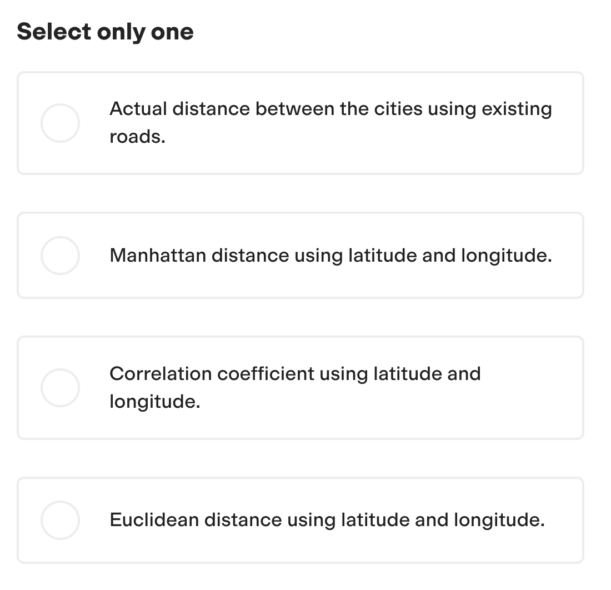

# Pass any TestGorilla Assessment 🦍

These last days, I've been invited to many TestGorilla Assessments for the Python Developer positions I've been applying for.

It was a bit annoying when, after being invited to complete an assessment at TestGorilla for a Python AI Developer role I applied for—where the job description emphasized:

> Python, FastAPI, LLMs, OpenAI, Embeddings, RAG, Function-calling, structured output, Fine-tuning (you know, the usual Python AI role)

I realized the test was focused on Machine Learning rather than Applied AI… But I decided to go along with it anyway.

One of the first questions was the following:

The question wasn't related to the technologies or tools I work with, nor did it have anything to do with the job description. It was a poor choice of questions because they assumed Machine Learning and Applied AI with LLMs are the same, but they are actually very different fields.

I didn't know the answer to this question, and I encountered several other questions centered around classic ML concepts that weren't relevant to my expertise. After failing the test, I decided that I wasn't going to let outdated evaluations like this be the reason I got rejected—especially when applying for an **AI DEVELOPER ROLE** in the AI era.

So, I decided to get creative and build something:

## The Tool 🛠️

I created a small script that listens for my Option key on my MacBook keyboard. When pressed, it takes a screenshot of the screen. This screenshot is immediately sent to GPT-4 Vision for analysis, specifically structured to answer multiple-choice questions.

Once GPT-4 Vision processes the screenshot, it sends back a structured response with the answer as a single number (e.g., 1, 2, 3, etc.). The script then uses the macOS notification system to alert me of the answer discreetly, ensuring I don't need to swap windows or alt-tab, which TestGorilla monitors. This way, I stay within the test environment without triggering any suspicion.

### Results 🎯

After using the tool, I got a **10/10** in all the tests I've done so far. It worked flawlessly and allowed me to stay undetected while getting the answers I needed.

### Why This Matters

I did this as a proof of concept to show that these kinds of tests are outdated and don't adapt to the LLM AI Age. Companies hiring for Python AI developers should be the first ones to notice this and change the process. It's ironic that this isn't happening. The fact that I cheated by building this tool, for some people, would be an even better technical test than the test itself.